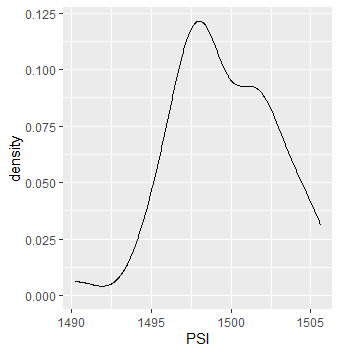
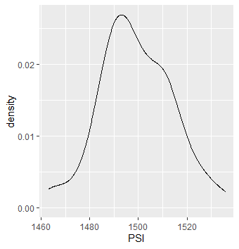
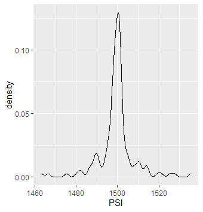
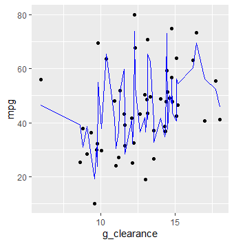
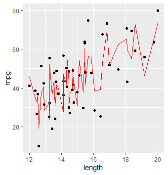
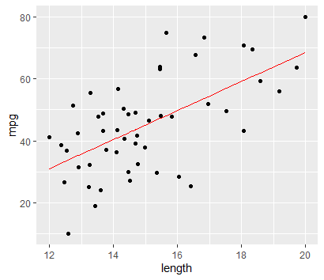
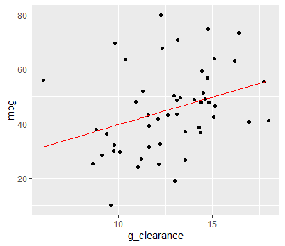

# R_Statistics

## Normal distribution plots (lot1,lot2,lot3,population)

## Linear Model Plots(ground clearance,length) 
mpg = -91.5573 + 6.0811*[length] + 3.5669*[ground clearance]

## Linear Model Plots(length)(p-value = 2.63e-06)
mpg = -25.0622 + 4.6733*length

## Linear Model Plots(ground clearance) (p-value = 0.0198)
mpg = 19.4175 + 2.0222*ground_clearance

